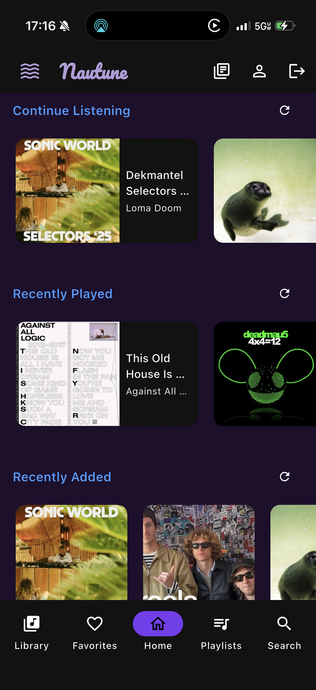
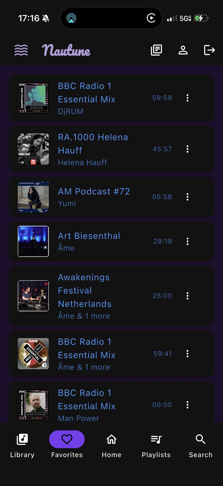
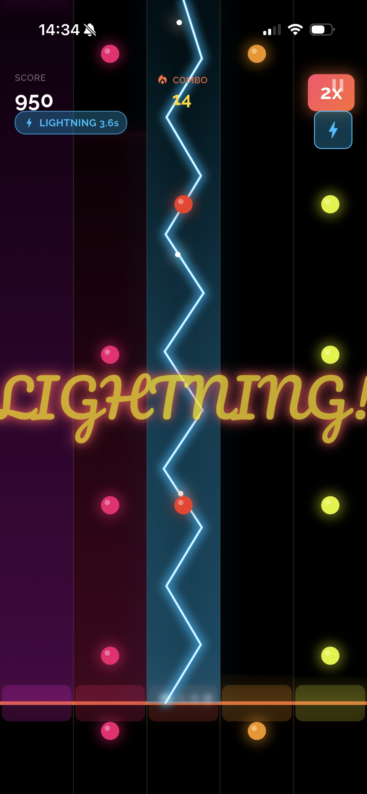
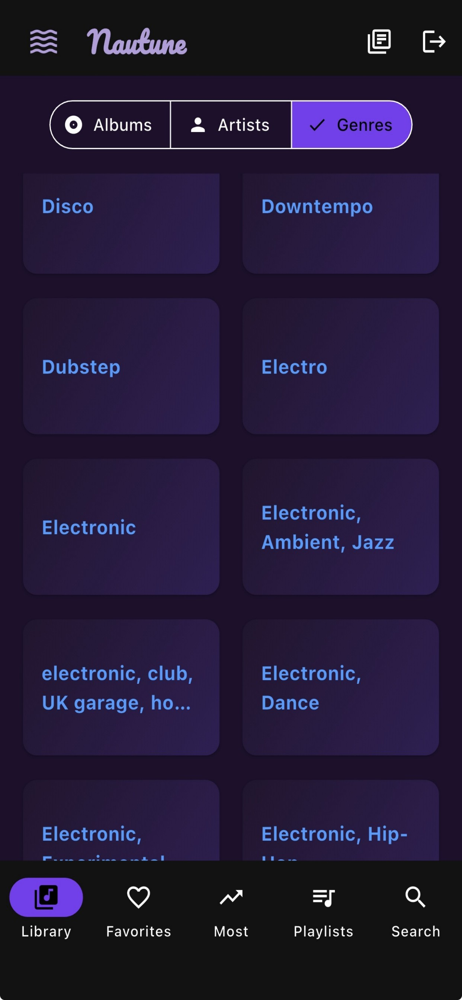
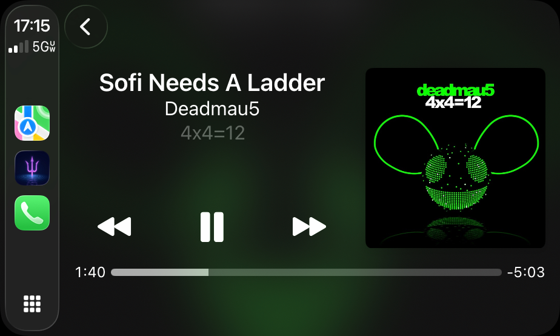
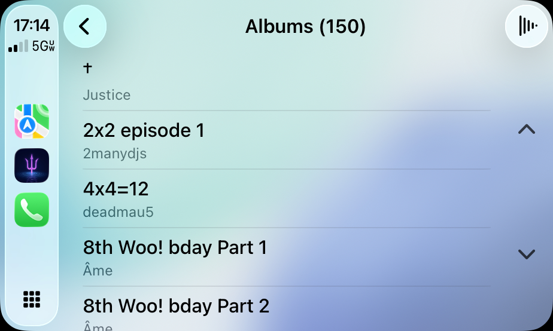
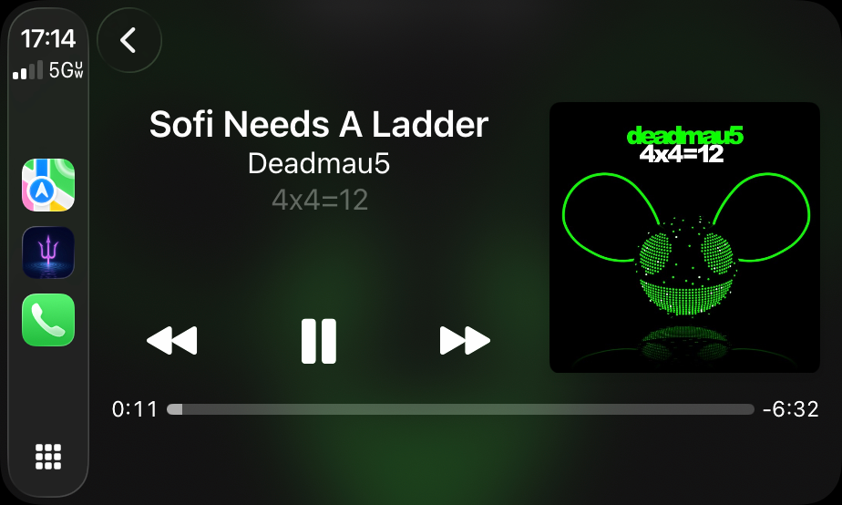

# Nautune 🔱🌊

**Nautune** (Poseidon Music Player) is a high-performance, visually stunning music client for Jellyfin. Built for speed, offline reliability, and an immersive listening experience.

## 🚀 Latest Updates (v3.6.0)
- **📊 Enhanced Profile & Stats**:
  - ✅ **Accurate Top Artists & Albums**: Now calculated from your actual track play history (aggregated from individual track plays).
  - ✅ **Genre Breakdown**: See your top genres with colorful progress bars showing listening distribution.
  - ✅ **Listening Insights**: Average track length, longest/shortest tracks you've listened to.
  - ✅ **Library Diversity Score**: See how varied your listening habits are with unique artists/albums count and diversity percentage.
  - ✅ **Logout Confirmation**: Added "Are you sure?" dialog to prevent accidental logouts.
- **👤 Immersive Profile & Stats** (v3.5.0):
  - ✅ **Deep Listening Stats**: Track your habits with "Total Plays" and "Listening Hours" (calculated from your top 100 tracks).
  - ✅ **Dynamic Backgrounds**: The profile screen now features a beautiful background gradient extracted from your most-played track's album art.
  - ✅ **Organized Dashboard**: 3-row grid layout for quick stats (Total Plays, Hours, Top Artist, Top Album, Artists, Albums, Diversity).
  - ✅ **Jellyfin Integration**: Personalized profile image and server info directly from your account.
- **🔍 Unified Global Search**:
  - ✅ **Instant Discovery**: Search across albums, artists, and tracks simultaneously in a single view.
  - ✅ **Clean Results**: Grouped categorization for a faster, more intuitive browsing experience.
  - ✅ **Parallel Performance**: Uses batch API calls to deliver results with near-zero latency.
- **🛠 Code Modernization**:
  - ✅ **Flutter 3.9+ Ready**: Transitioned to the latest transparency APIs (`withValues`) and removed deprecated code.
  - ✅ **Enhanced Reliability**: Safe shadowing of core services to prevent potential null-pointer crashes during background tasks.


## ✨ Key Features
- **Global Search**: Unified search across your entire library with instant results.
- **Smart Offline Mode**: Full support for downloaded content with seamless transition when connectivity is lost.
- **High-Fidelity Playback**: Native backends for all platforms ensuring bit-perfect audio.
- **Visual Palette Extraction**: UI elements dynamically change color based on the current track's artwork.
- **CarPlay Support**: Take your Jellyfin library on the road with a dedicated CarPlay interface.

## 🛠 Technical Foundation
- **Framework**: Flutter (Dart)
- **Local Storage**: Hive (NoSQL) for high-speed metadata caching.
- **Audio Engine**: Audioplayers with custom platform-specific optimizations.
- **Image Processing**: Material Color Utilities for vibrant palette generation.

## 📂 File Structure (Linux)
Nautune follows a clean data structure on Linux for easy backups and management:
- `~/Documents/nautune/`: Primary application data.
- `~/Documents/nautune/downloads/`: High-quality offline audio files.
- `~/Documents/nautune/downloads/artwork/`: Cached album and artist imagery.

---
*Nautune - Rule the waves of your music library.*

## 📸 Screenshots

### Linux / Desktop


### iOS









### CarPlay






## 🧪 Review / Demo Mode

Apple's Guideline 2.1 requires working reviewer access. Nautune includes an on-device demo that mirrors every feature—library browsing, downloads, playlists, CarPlay, and offline playback—without touching a real Jellyfin server.

1. **Credentials**: leave the server field blank, use username `tester` and password `testing`.
2. The login form detects that combo and seeds a showcase library with open-source media. Switching back to a real server instantly removes demo data (even cached downloads).

## 🔧 Development

### Run in Debug Mode
```bash
flutter run -d linux --debug
```

### Build Release
```bash
flutter build linux --release
```

### Build Deb Package (Linux)
```bash
# Requires: dart pub global activate fastforge
fastforge package --platform linux --targets deb
```

### Static Analysis
```bash
flutter analyze
```

## 📄 License

This project is licensed under the MIT License - see the [LICENSE](LICENSE) file for details.

**Made with 💜 by ElysiumDisc** | Dive deep into your music 🌊🎵
