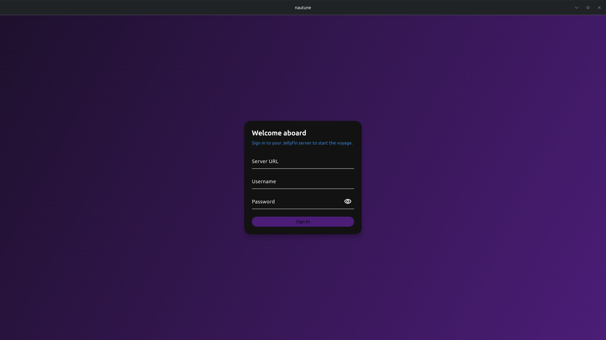
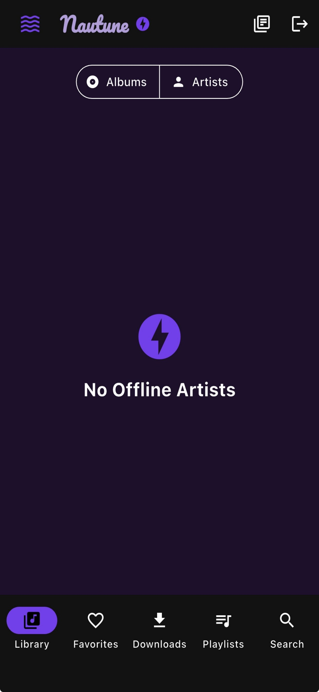

# Nautune 🎵🌊

Poseidon's cross-platform Jellyfin music player. Nautune is built with Flutter and delivers a beautiful deep-sea themed experience with smooth native audio playback and seamless Jellyfin integration.

## 🚀 Latest Updates (v3.0.0)
- **💾 Advanced Storage Management**:
  - ✅ **Detailed Breakdown**: See exactly how much space each album and artist is using.
  - ✅ **Smart Cleanup**: New tools to "Free 500MB" or "Clean Old Downloads" (older than 30 days) with one tap.
  - ✅ **Storage Limits**: Set a hard cap on how much space Nautune can use (e.g., 2GB, 5GB, 10GB).
  - ✅ **Auto-Cleanup**: Automatically remove downloads older than a configurable number of days.
- **📥 Intelligent Download Service**:
  - ✅ **Parallel Downloads**: Configurable concurrency (1-10 simultaneous downloads) for blazing fast library syncing.
  - ✅ **WiFi-Only Enforcement**: Option to pause all downloads when on mobile data to save your data plan.
  - ✅ **Background Notifications**: Real-time progress notifications in the system tray/shade showing download status even when the app is minimized.
  - ✅ **Quick Download Presets**: One-tap buttons to download all your "Favorites," your "Top 20 Played," or "Recently Added" tracks.
- **📈 Listen Time Tracking**:
  - ✅ **Detailed Stats**: Nautune now tracks exactly how many times you've played a track and for how long.
  - ✅ **Offline Persistence**: Stats are tracked even in airplane mode and synced/saved locally.
  - ✅ **Data-Driven Discovery**: Powers the "Most Played" shelves with real, accurate listening data.
- **🔄 Enhanced Offline Sync**:
  - ✅ **Sync Status Indicator**: New animated icon in the app bar shows real-time sync status (syncing, pending actions, or offline).
  - ✅ **Offline Action Queue**: Hearting tracks or creating playlists while offline is now more robust with improved retry logic and visual status.

## 🚀 Previous Updates (v2.8.0)
- **🎵 Synced Lyrics Experience**:
  - ✅ **Beautiful Lyrics UI**: New dedicated tab in the full-screen player with high-quality typography
  - ✅ **Auto-Scrolling**: Active lyrics automatically center and scroll smoothly as the song plays
  - ✅ **Tap-to-Seek**: Click any lyric line to instantly jump the audio to that exact moment
  - ✅ **Intelligent Interactions**: Auto-scroll pauses when you're manually browsing lyrics and resumes after 2 seconds
  - ✅ **Visual Focus**: Past lines are subtly dimmed while the current line is highlighted with primary colors and soft shadows
- **🔒 Security Hardening**:
  - ✅ **Removed sensitive debug logging**: API error responses no longer log full body content that may contain user data
  - ✅ **Android network security config**: Explicit network security policy with documented cleartext allowance for local Jellyfin servers
  - ✅ **Improved URL validation**: Server URLs now validated for proper format (scheme, host) before use
  - ✅ **Session migration robustness**: Encrypted storage migration now handles corrupt data gracefully instead of silently failing
- **⚡ Performance Optimizations**:
  - ✅ **Color extraction moved to isolate**: Album art gradient extraction now runs in background isolate, eliminating UI jank when switching tracks
  - ✅ **Fixed memory leak**: System tray stream listeners now properly cancelled on dispose
  - ✅ **Cached filtered favorites**: Offline favorites list no longer recomputed on every frame

## 🚀 Previous Updates (v2.7.5)
- **🎵 Advanced Playlist Management**:
  - ✅ **Drag-and-Drop Reordering**: Long-press and drag tracks to reorder them in any playlist
  - ✅ **Offline Playlist Sync**: Download entire playlists with a single tap for airplane-mode listening
  - ✅ **Visual Enhancements**: Playlist tracks now show individual album artwork instead of generic icons
- **🎧 Playback Experience**:
  - ✅ **Fade-on-Pause / Resume**: Smooth 400ms volume ramping when pausing/resuming for a premium audio feel
  - ✅ **Swipe-to-Skip**: Horizontal swipe gestures on the bottom mini-player bar for quick track changes
  - ✅ **Tray Robustness**: Improved Linux system tray stability with better error handling for missing platform plugins
- **🎨 Immersive Visuals**:
  - ✅ **Professional Color Extraction**: Migrated to `material_color_utilities` (Material You engine) for high-quality palette generation
  - ✅ **Vibrant Gradients**: More pronounced and smoother background gradients in the full-screen player based on album art

## 🚀 Previous Updates (v2.7.0)
- **🔧 Critical Bug Fixes**: Improved reliability across all platforms
  - ✅ **Album continuous playback fixed**: Playing state now properly emitted after gapless transitions
    - Previously, albums would pause after each song instead of playing continuously
    - Fixed by explicitly emitting playing state when swapping preloaded players
  - ✅ **iOS state persistence fixed**: App now reliably saves playback state when backgrounded
    - Save operations are now properly awaited before app suspension
    - Hive storage flushes to disk immediately instead of buffering in memory
    - Volume setting now included in pause/background state snapshots
  - ✅ **Stop properly clears playback state**: Fixed nullable field handling in clearPlayback()
    - Previously, stop button wasn't fully clearing queue/track state due to Dart's `??` operator
    - Now directly constructs clean state object while preserving UI settings
  - ✅ **Alphabet scrollbar sorting fixed**: Now works correctly with all sort orders
    - Rewrote with O(1) letter-to-index lookup map for better performance
    - Properly handles ascending/descending sort with nearest-letter fallback
    - Fixed scroll position calculation and bubble positioning
- **📥 Album Track Pre-Caching**: Smoother playback when listening to albums
  - ✅ **Auto pre-cache on play**: When you play an album, remaining tracks cache in background
  - ✅ **Smart source priority**: Downloads → Cached files → Stream (fastest available)
  - ✅ **Gapless preload uses cache**: Next track preloading checks cache first
  - ✅ **Automatic cleanup**: Cache auto-expires after 7 days, max 500 files
  - ✅ **Manual clear**: Settings → Performance → "Clear Audio Cache" button

## 🚀 Previous Updates (v2.5.0)
- **⚡ API & Performance Optimizations**: Faster, more reliable server communication
  - ✅ **Batch API Requests**: Albums, artists, genres load in parallel with `Future.wait()`
  - ✅ **Request Retry with Backoff**: Auto-retries failed requests 3x with exponential backoff
  - ✅ **HTTP Connection Pooling**: Reuses connections for faster subsequent requests
  - ✅ **ETag Caching**: Skips re-downloading unchanged data (304 responses)
  - ✅ **Server Health Check**: Ping server before heavy operations
  - ✅ **Graceful Timeout Handling**: Shows "server slow" instead of cryptic errors
- **⚙️ Cache Configuration**: Fine-tune performance
  - ✅ **Configurable TTL**: Settings → Performance → Cache Duration (5 minutes to 1 week)
  - ✅ **Album Track Caching**: Pre-cache track lists for downloaded albums
  - ✅ **Persisted setting**: Cache preference survives app restarts
- **📳 Haptic Feedback (Mobile)**: Tactile response on iOS/Android
  - ✅ **Play/Pause**: Light tap feedback
  - ✅ **Next/Previous**: Medium tap feedback
  - ✅ **Platform-aware**: Only triggers on mobile devices
- **🔧 Code Quality**: Debouncer/Throttler utilities for search and scroll events

## 🚀 Previous Updates (v2.4.0)
- **📻 Infinite Radio Mode**: Never-ending music discovery
  - ✅ **Auto-generates queue**: Fetches similar tracks when queue runs low (≤2 tracks remaining)
  - ✅ **Powered by Jellyfin InstantMix**: Uses server-side similarity analysis
  - ✅ **Seamless continuation**: New tracks append silently without interrupting playback
  - ✅ **No duplicates**: Automatically filters out tracks already in queue
  - ✅ **Toggle in Settings**: Enable/disable under Audio Options
  - ✅ **Persisted preference**: Setting survives app restarts
- **🔢 Sorting Options**: Organize your library your way
  - ✅ **Albums sort**: By name, date added, year, or play count
  - ✅ **Artists sort**: By name, date added, or play count
  - ✅ **Ascending/descending**: Toggle sort direction with one tap
  - ✅ **Server-side sorting**: Fast results via Jellyfin API
  - ✅ **Clean UI**: Dropdown + direction button in Library tab header
- **🔲 System Tray (Desktop)**: Background playback controls
  - ✅ **Linux/Windows/macOS**: Native system tray integration
  - ✅ **Playback controls**: Play/Pause, Previous, Next from tray menu
  - ✅ **Track info**: Current song displayed in tooltip and menu
  - ✅ **Quick access**: Right-click for context menu
  - ⚠️ **Linux requirement**: `libayatana-appindicator3-dev` package

## 🚀 Previous Updates (v2.3.0)
- **💾 Enhanced Playback State Persistence**: Never lose your place again
  - ✅ **Pause saves everything**: Queue, position, track, repeat mode, shuffle state all preserved
  - ✅ **Resume exactly where you left off**: App remembers your exact playback position after pause
  - ✅ **Force-close protection**: Full state saved on app lifecycle events (background, inactive, detached)
  - ✅ **iOS & Linux support**: Works reliably on both platforms even after force quit
  - ✅ **Stop still clears**: Stop button intentionally clears queue for fresh start (unchanged)
- **🚗 CarPlay Fixes**: App now properly appears in CarPlay
  - ✅ **Entitlements linked**: Fixed `CODE_SIGN_ENTITLEMENTS` configuration in Xcode project
  - ✅ **AppDelegate fixed**: Returns `true` directly for CarPlay compatibility
  - ✅ **Early initialization**: CarPlay service initializes immediately on app start
  - ✅ **Works offline**: Browse and play downloaded music in car without internet

## 🚀 Previous Updates (v2.1.0+)
- **🚗 Enhanced CarPlay Integration**: Smarter, more reliable car experience
  - ✅ **Connection state tracking**: Properly detects CarPlay connect/disconnect events
  - ✅ **Auto-refresh on connect**: Library content refreshes when CarPlay connects
  - ✅ **Auto-refresh on data change**: Content updates when library data changes
  - ✅ **Empty state handling**: Clear messages when no albums/playlists/favorites available
  - ✅ **Proper queue context**: Playing tracks from CarPlay now queues the full album/playlist
  - ✅ **Offline-aware messaging**: Empty states show different messages when offline
- **📱 iOS App Lifecycle Management**: Robust state persistence
  - ✅ **Background state saving**: Playback state saved immediately when app goes to background
  - ✅ **Resume connectivity check**: Connectivity checked when app returns to foreground
  - ✅ **Lifecycle observer**: Proper `WidgetsBindingObserver` integration for pause/resume
  - ✅ **Seamless restore**: Resume exactly where you left off after backgrounding
- **🔄 Smoother Offline/Online Transitions**: Graceful network handling
  - ✅ **Debounced online detection**: 2-second delay prevents flicker from unstable connections
  - ✅ **Instant offline detection**: Going offline is immediate - users know right away
  - ✅ **Smart mode switching**: Only switches back to online mode after successful data refresh
  - ✅ **Background refresh**: Data refreshes in background after reconnection
  - ✅ **Graceful fallback**: Stays offline if refresh fails after reconnect

## 🚀 Previous Updates (v2.0.0+)
- **💎 The "Silver Bullet" Progress Bar**: Buttery smooth tracking
  - ✅ **Jitter-Free**: Replaced jumping sliders with `audio_video_progress_bar`
  - ✅ **RxStream Synchronization**: Unified `PositionData` stream combines current position, buffered status, and metadata duration using `rxdart`
  - ✅ **Instant Feedback**: Metadata duration is injected into the stream immediately upon selection, eliminating "--:--" lag
- **⚡ True Gapless Player Swapping**: Zero-latency transitions
  - ✅ **Dual-Player Engine**: Implemented physical player swapping (`_player` ↔ `_nextPlayer`) for instant track changes
  - ✅ **Dynamic Listener Re-attachment**: UI and media controls automatically follow the active player instance during swaps
  - ✅ **MPRIS/Lockscreen Sync**: Media controls stay synchronized with the active audio instance even across track boundaries
- **🛡️ Playback Stability**:
  - ✅ **Non-Blocking Stop**: "Stop" command now kills audio immediately and skips awaiting network reporting to prevent deadlocks
  - ✅ **BehaviorSubject State**: Core playback streams migrated to `BehaviorSubject` for instant UI hydration on screen entry
  - ✅ **Deadlock Prevention**: Fixed "Ghost Playback" where audio would continue if the network call to the server hung

## 🚀 Previous Updates (v1.9.9+)
- **🔧 UI/UX Improvements**: Critical bug fixes for better user experience
  - ✅ **Alphabet scrollbar fix**: Letters in Albums/Artists/Genres tabs are now fully tappable
    - Fixed hit test behavior with `HitTestBehavior.opaque` for reliable touch detection
    - Expanded touch targets from 20px to 28px width for better accessibility
    - Each letter gets equal vertical space for easier navigation
  - ✅ **Downloaded track duration accuracy**: Durations now match actual audio files everywhere
    - Extracts real duration from downloaded audio files using `audioplayers` API
    - Updates track metadata automatically after download completes
    - Favorites tab merges accurate durations from downloaded tracks
    - Fixes issue where server-reported duration didn't match local files
  - ✅ **Fullscreen player artwork reliability**: Album art and gradients always load correctly
    - Fixed gradient extraction to use same fallback logic as artwork display
    - Now properly falls back to album art when track-specific art is missing
    - Gradient background updates immediately when tracks change
  - ✅ **Favorites tab loading performance**: Smoother list rendering without layout shifts
    - Album art wrapped in fixed 56x56 SizedBox to prevent reflow
    - Added placeholder icons that display during image loading
    - List items maintain stable layout as images load asynchronously
  - ✅ **Download queue management fix**: Can now remove items from download queue
    - Fixed bug where queued/downloading items couldn't be removed
    - Cancelling queued downloads now properly removes them from queue
    - Only completed downloads trigger physical file deletion
    - Prevents errors when attempting to delete non-existent files
- **🎵 Fullscreen Player Navigation**: Click artist/album to explore while listening
  - ✅ **Clickable artist**: Tap artist name to open artist detail screen with all their albums
  - ✅ **Clickable album**: Tap album name to see full album tracklist
  - ✅ **Visual indicators**: Underlined text + icons show items are interactive
  - ✅ **Offline support**: Works in airplane mode with downloaded content
  - ✅ **Smart fallback**: Searches online cache first, then creates synthetic objects from downloads
- **🖼️ Offline Album Artwork**: Album art now works perfectly in offline mode
  - ✅ **Auto-download**: Album art automatically downloaded when you download tracks/albums
  - ✅ **Airplane mode ready**: Fullscreen player, favorites, and all tabs show artwork without internet
  - ✅ **Smart fallback**: Checks local storage first, then falls back to network/cache
  - ✅ **Auto-cleanup**: Album art deleted automatically when tracks/albums are removed
  - ✅ **Storage efficient**: Artwork stored as optimized JPEGs in `downloads/artwork/`
- **🎨 UI/UX Refinements**: Better browsing experience
  - ✅ **Alphabet scroll bar**: Quick jump to any letter in Albums, Artists, and Genres tabs
  - ✅ **Artist pagination**: Browse ALL artists (no more stopping at "C")
  - ✅ **Favorites tab album art**: Beautiful artwork thumbnails replace generic music notes
- **🔧 Metadata Consistency**: Fixed audio quality display across all sources
  - ✅ **Consistent fields**: Favorites, playlists, and instant mix now use correct `MediaStreams` field
  - ✅ **Full audio info everywhere**: FLAC • 1411 kbps • 16-bit/44.1kHz displayed in all playback contexts
- **💾 Save Instant Mix as Playlist**: Save your favorite mixes for future listening
  - ✅ **One-tap save**: "Save as Playlist" button appears in snackbar after creating mix
  - ✅ **Smart naming**: Auto-suggests names like "Artist Mix", "Album Mix", "Track Mix"
  - ✅ **Custom names**: Edit the suggested name before saving
  - ✅ **Available everywhere**: Works from artist, album, and track instant mix buttons
  - ✅ **Jellyfin sync**: Saved playlists sync to server immediately
- **🎨 Immersive Fullscreen Player**: Dynamic gradient backgrounds from album art
  - ✅ **Color extraction**: Automatically extracts dominant colors from album artwork
  - ✅ **Gradient background**: Beautiful multi-color gradient with subtle opacity
  - ✅ **Real-time updates**: Background adapts as tracks change with smooth transitions
  - ✅ **Fixed refresh issues**: Album art and gradient now update immediately when track changes
  - ✅ **Removed visualizer**: Cleaner, more focused fullscreen experience
- **🛡️ Download Dependency Tracking**: Intelligent file management
  - ✅ **Reference counting**: Tracks ownership of downloaded files (albums vs playlists)
  - ✅ **Prevents data loss**: Deleting an album won't delete tracks that are also in your playlists
  - ✅ **Smart cleanup**: Only deletes physical files when *all* references are removed
  - ✅ **Context-aware deletion**: "Remove from Download Manager" keeps files if they belong to an album
- **🖼️ Tiered Image Loading**: High-performance artwork caching
  - ✅ **Smart resolution**: Automatically fetches thumbnails for lists and high-res for detail views
  - ✅ **Memory & Disk Caching**: Powered by `cached_network_image` for instant re-loads
  - ✅ **Offline support**: Cached images work perfectly in airplane mode
  - ✅ **Bandwidth saver**: Drastically reduces server load and data usage
- **⚡ Storage Engine Migration**: Complete move to Hive
  - ✅ **Unified storage**: Migrated SharedPreferences to Hive boxes (session, playlists, playback state)
  - ✅ **Better performance**: Faster read/write operations for large datasets
  - ✅ **Structured data**: Type-safe storage for complex objects
  - ✅ **Zero-migration**: Seamlessly transitions data for existing users
- **🍏 iOS Path Verification**: robust offline support for iPhone updates
  - ✅ **Automatic recovery**: Detects when iOS changes app container UUIDs (common on app updates)
  - ✅ **Path rescue**: Automatically finds and relinks downloaded files in the new location
  - ✅ **Self-healing**: Runs on every app startup to ensure your offline library never disappears
- **🎧 Audio Quality Display**: Audiophile-grade metadata in fullscreen player
  - ✅ **Rich audio info**: Shows format, bitrate, sample rate, bit depth, and channel layout
  - ✅ **Example output**: "FLAC • 1411 kbps • 16-bit/44.1 kHz • Stereo"
  - ✅ **Automatic parsing**: Reads MediaStreams data from Jellyfin API
  - ✅ **Beautiful design**: Rounded container with ocean theme styling
  - ✅ **Always visible**: Displayed below album name when metadata is available
- **▶️ Play Next & Queue Management**: Advanced queue control for power users
  - ✅ **Play Next**: Add tracks to play immediately after current song (without disrupting queue)
  - ✅ **Add to Queue**: Append tracks to end of queue
  - ✅ **Available everywhere**: Album tracks, favorites, search results, fullscreen player
  - ✅ **Smart queue handling**: Automatically manages queue indices and pre-loading
  - ✅ **User feedback**: Toast notifications confirm queue operations
- **✨ Instant Mix Integration**: Server-powered music discovery via Jellyfin
  - ✅ **One-tap mixes**: Create 50-track playlists from any track, album, or artist
  - ✅ **Save as playlist**: One-tap save button in snackbar after creating mix
  - ✅ **Smart naming**: Auto-suggests contextual names (Artist/Album/Track Mix)
  - ✅ **Server-side matching**: Jellyfin analyzes music similarity (genre, era, style, audio features)
  - ✅ **Multiple entry points**: Sparkle icon (✨) in album/artist detail screens
  - ✅ **Track context menus**: Instant Mix option in all three-dot menus
  - ✅ **Auto-play**: Mix starts playing immediately after generation
  - ✅ **Smart feedback**: Loading states and error handling for empty results
  - ℹ️ **Note**: Limited to 50 tracks per mix (Jellyfin API default)
- **🔀 UI Polish**: Better iconography across the app
  - ✅ **Shuffle icon**: Replaced emoji (🌊🌊) with proper Material Icons.shuffle
  - ✅ **Consistent design**: Professional icons in album and playlist screens
- **🏗️ Phase 2 Architecture Migration - 100% Complete!**: Major Provider pattern adoption
  - ✅ **All 10 screens migrated**: SettingsScreen, QueueScreen, FullPlayerScreen, AlbumDetailScreen, ArtistDetailScreen, PlaylistDetailScreen, GenreDetailScreen, OfflineLibraryScreen, and LibraryScreen
  - ✅ **Auto-refresh on connectivity**: Detail screens automatically reload when switching online/offline modes
  - ✅ **Smarter state management**: Screens use `Provider.of<NautuneAppState>` instead of parameter passing
  - ✅ **Better separation**: UI components decoupled from god object
  - ✅ **LibraryScreen complete**: Most complex screen (5 tabs) now uses Provider pattern
- **🎨 Home Screen Redesign**: Clean horizontal-only layout with 6 discovery shelves
  - ✅ **Continue Listening**: Resume tracks from where you left off
  - ✅ **Recently Played**: Tracks you've played recently
  - ✅ **Recently Added**: Latest albums added to your library
  - ✅ **Most Played Albums**: Your most-listened albums
  - ✅ **Most Played Tracks**: Your favorite tracks
  - ✅ **Longest Tracks**: Epic tracks for long listening sessions
  - ✅ **Removed vertical clutter**: Eliminated "Explore Tracks" filter section
  - ✅ **Consistent design**: All shelves follow same horizontal scroll pattern
  - ✅ **Data loading**: Parallel loading of all shelf content on library selection
  - ✅ **Demo mode support**: All shelves work in demo mode with sample data
- **🔄 Smart Auto-Refresh**: Detail screens reactively update on connectivity changes
  - ✅ **Album details**: Automatically reload tracks when going online/offline
  - ✅ **Playlist details**: Refresh when connectivity state changes
  - ✅ **Genre details**: Auto-reload albums when network status changes
  - ✅ **No manual refresh needed**: Seamless experience when airplane mode toggles
  - ✅ **Listen-based updates**: Uses Provider pattern for reactive state changes

## 🚀 Previous Updates (v1.8.3+)
- **⚡ Smart Track Pre-Loading**: Intelligent buffering for truly gapless playback
  - ✅ **70% pre-load trigger**: Automatically loads next track when current reaches 70%
  - ✅ **Platform buffering**: Native audio decoders buffer actual audio data
  - ✅ **Instant transitions**: Near-zero gap between tracks when pre-loaded
  - ✅ **Respects queue & repeat modes**: Works with shuffle, repeat one/all
  - ✅ **Auto-cleanup**: Clears pre-load when queue changes
  - ✅ **Works offline & online**: Pre-loads both streaming and downloaded tracks
- **🧹 Codebase Cleanup**: Removed 100+ lines of dead stream caching code
  - ✅ **Before**: Cached stream URLs (text only, no actual benefit)
  - ✅ **After**: True pre-loading with platform audio buffering
  - ✅ **Result**: Cleaner codebase, better performance
- **🎨 Enhanced Home Tab UI**: Beautiful new layout with better spacing
  - ✅ **Section headers**: Clear "Explore Tracks" label with primary color
  - ✅ **FilterChips instead of SegmentedButton**: Better labels with icons
  - ✅ **Horizontal scrollable**: "Most Played", "History", "New Additions", "Longest"
  - ✅ **Better spacing**: Proper vertical spacing between shelves
  - ✅ **Improved hierarchy**: Clearer visual structure
- **📱 Fixed Demo Mode Transitions**: Seamless offline/demo mode switching
  - ✅ **Demo mode preserved**: Toggling offline library no longer exits demo mode
  - ✅ **Smart detection**: UI-only offline toggle when in demo mode
  - ✅ **No unnecessary syncs**: Demo mode doesn't attempt server refreshes
  - ✅ **Debug logging**: Clear mode transition tracking
- **🎵 Fullscreen Player Redesign**: Optimized layout for better focus
  - ✅ **Larger album art**: Up to 500px/85% width, 50% screen height
  - ✅ **Expanded layout**: Artwork gets 3x vertical space
  - ✅ **Controls pinned to bottom**: All widgets (progress, volume, playback) at bottom
  - ✅ **Better spacing**: Proper vertical distribution
  - ✅ **Enhanced lyrics**: Larger text (24px active, 18px inactive), better line height
- **🖼️ Image Caching**: Persistent disk + memory caching for artwork
  - ✅ **cached_network_image package**: Industry-standard image caching
  - ✅ **Disk cache**: Artwork persists across app restarts
  - ✅ **Memory cache**: Size-optimized for performance
  - ✅ **Reduced network**: Cached images don't re-download
  - ✅ **Faster scrolling**: Smooth album/artist grid browsing
- **🔌 Offline/Online Mode Fixes**: Auto-refresh when network returns
  - ✅ **Network monitoring**: Proper connectivity change detection
  - ✅ **Auto-refresh**: Libraries refresh when internet returns
  - ✅ **Offline mode toggle**: Properly exits offline mode when network available
  - ✅ **Demo mode safe**: Won't trigger refreshes in demo mode

## 🚀 Previous Updates (v1.5.0+)
- **🔧 Architecture Refactoring & Stability**: Major under-the-hood improvements
  - ✅ **Phase 1 Complete**: Core state logic migrated to focused providers (`SessionProvider`, `DemoModeProvider`, etc.)
  - ✅ **Demo Mode Fixed**: Resolved track listing issues, infinite loops, and startup crashes
  - ✅ **Legacy Compatibility**: Seamless bridge between legacy `NautuneAppState` and new architecture
  - ✅ **Solid Foundation**: codebase is now ready for Phase 2 widget refactoring
- **⌨️ Desktop Keyboard Shortcuts**: Full keyboard control for power users (Linux/Windows/macOS)
  - ✅ **Space** - Play/Pause
  - ✅ **Left/Right Arrows** - Seek backward/forward 10 seconds
  - ✅ **Up/Down Arrows** - Volume up/down 5%
  - ✅ **N** - Next track, **P** - Previous track
  - ✅ **R** - Toggle repeat mode
  - ✅ **L** - Toggle favorite
- **🔊 ReplayGain / Normalization**: Automatic volume leveling prevents jumps between albums
  - ✅ Reads `NormalizationGain` from Jellyfin metadata
  - ✅ Applies automatic volume adjustment (dB to linear conversion)
  - ✅ Clamped to safe range (0.1-2.0x) to prevent extremes
  - ✅ Works with streaming and offline playback
  - ✅ No more ear-blasting when switching from quiet classical to loud rock!
- **🎵 Lyrics API Integration**: Full Jellyfin lyrics support (UI coming soon)
  - ✅ `JellyfinClient.fetchLyrics()` retrieves synced lyrics from server
  - ✅ Structured data with timestamps for auto-scrolling
  - ✅ Graceful fallback when lyrics unavailable
  - ✅ Ready for Lyrics UI tab implementation
- **⚡ Crossfade Optimization**: Resource-efficient audio transitions
  - ✅ **Before**: Created new AudioPlayer for every track (memory churn)
  - ✅ **After**: Reuses single `_crossfadePlayer` instance (initialized once)
  - ✅ Drastically reduced memory usage during transitions
  - ✅ Stops/resets player instead of disposing
  - ✅ More stable on mobile devices
- **⚡ Instant Startup + Offline Cache**: Nautune now boots instantly using a local Hive cache for your libraries, playlists, "Continue Listening," and Recently Added.
  - ✅ New bootstrap service hydrates the UI from disk immediately, then refreshes Jellyfin data in the background with smart timeout + retry logic
  - ✅ Startup never blocks on album/artist fetches—slow servers simply update the cache silently once they respond
  - ✅ Library home adds cached hero shelves (“Continue Listening” + “Recently Added”) so the main menu always has content, even offline
  - ✅ Online refreshes merge back into the cache so subsequent launches stay instant
- **🔍 Track Search Toggle**: Search tab now lets you flip between albums, artists, and tracks.
  - ✅ Tracks scope hits your Jellyfin library when online for fully playable results
  - ✅ Offline mode searches downloaded tracks so airplane-mode listening still works
  - ✅ Results drop you straight into playback with one tap
  - ✅ Remembers your last few searches per scope for one-tap re-run or clearing
- **🎛️ External Media Control Stability**: Rock-solid USB-C & Bluetooth controls
  - ✅ **Crash-free skip controls**: Fixed app crashes when using car USB-C or Bluetooth headphones
  - ✅ **Error handling**: Try-catch protection for all external media control inputs
  - ✅ **Repeat mode support**: Skip controls now respect repeat all/one modes
  - ✅ **Boundary safety**: Safe queue navigation at start/end of playlist
- **🎨 Album Card Text Fix**: Perfect text rendering on all platforms
  - ✅ **iOS text overflow fixed**: Album names with long artists no longer cut off
  - ✅ **Optimized line height**: 1.2 line height ensures proper 2-line fitting
  - ✅ **Consistent across platforms**: Works on iOS, Android, Linux, all devices
- **⚡ Smart Track Pre-Loading**: True gapless playback with platform buffering
  - ✅ **Intelligent pre-loading**: Loads next track at 70% of current track
  - ✅ **Platform-level buffering**: Native audio decoders buffer actual audio data
  - ✅ **Instant transitions**: Near-zero gap when track is pre-loaded
  - ✅ **Works everywhere**: Streaming and offline tracks both pre-load
  - ✅ **Queue-aware**: Respects repeat modes and shuffle
- **🎵 Smart Crossfade (Level 2)**: Intelligent audio transitions
  - ✅ **Album-aware crossfade**: Automatically skips crossfade within same album (respects artist intent)
  - ✅ **Smooth exponential curves**: Natural-sounding quadratic fade in/out
  - ✅ **Works offline**: Crossfades both streamed and downloaded tracks
  - ✅ **Settings integration**: One-tap toggle in Audio Options
  - ✅ **Persistent**: Remembers your crossfade preference
  - ✅ **Queue-aware**: Works with repeat modes and shuffle
- **📥 Enhanced Downloads**: Individual track downloads with batch album support
  - ✅ Download single tracks from any screen (long-press or menu)
  - ✅ Download entire albums with one tap
  - ✅ **FLAC/Original Format**: Auto-detects and downloads in native format (FLAC, MP3, M4A, etc.)
  - ✅ Progress tracking for individual tracks and batches
  - ✅ Download cancellation support
  - ✅ Smart duplicate detection (won't re-download existing files)
  - ✅ **Automatic cleanup**: Verifies files on startup and removes orphaned references
  - ✅ **Better error handling**: Clear messages for missing or failed downloads
  - ✅ File format detection from Content-Type headers
- **🎵 Improved Playlist Management**: Full Jellyfin sync with offline queue
  - ✅ **Global playlist loading**: Shows all user playlists regardless of selected library
  - ✅ Create, rename, delete playlists with instant sync
  - ✅ Add tracks/albums to playlists from anywhere
  - ✅ **Offline queue system**: Operations queued when offline, auto-sync when online
  - ✅ **Local caching**: Playlists cached for offline viewing
  - ✅ Track count updates immediately after adding items
  - ✅ **Queue management**: Remove tracks, reorder, shuffle
- **❤️ Favorites Offline Support**: Heart tracks even without connection
  - ✅ Offline queue for favorite actions
  - ✅ Optimistic UI updates (immediate visual feedback)
  - ✅ Automatic sync when connection returns
  - ✅ Orange notification messages for queued actions
- **🎨 Refined Settings**: Streamlined audio options
  - ✅ Removed redundant playback/download sections
  - ✅ **Crossfade feature**: Album-aware toggle for smooth transitions
  - ✅ Cleaner, more focused settings UI
- **🗂️ Library Selection Filter**: Only music libraries shown
  - ✅ Playlists no longer appear as selectable libraries
  - ✅ Only "music" collection type shown on login
  - ✅ Cleaner library selection experience
- **💿 Multi-Disc Album Support**: Proper handling of multi-disc releases
  - ✅ Disc number grouping in album detail view
  - ✅ Disc separators with clear labeling (Disc 1, Disc 2, etc.)
  - ✅ Correct track ordering across discs
  - ✅ Preserves disc structure in queue and playback
- **🎚️ Volume Slider**: Direct audio control in now playing bar
  - ✅ Real-time volume adjustment via slider
  - ✅ Wired directly to audio player for instant response
  - ✅ Volume level persisted across sessions
- **🛫 Offline-First Boot**: App now boots directly into offline mode when no internet is available, giving instant access to downloaded music even in airplane mode or dead zones.
  - ✅ Connectivity probe (connectivity_plus + DNS lookup) detects real internet reachability before Jellyfin refreshes begin
  - ✅ 10-second timeout prevents infinite spinning on network failure
  - ✅ Graceful network failure handling during initialization
  - ✅ Cached credentials preserved for when connectivity returns
  - ✅ Offline banner with retry button shows when network is unavailable
  - ✅ Automatic sync when connectivity is restored
- **🚗 CarPlay Fix**: Fixed CarPlay not appearing on iOS devices by properly calling `FlutterCarplay.setRootTemplate()` during initialization
  - ✅ CarPlay icon now appears on CarPlay-enabled head units
  - ✅ Safe async initialization prevents iOS black screen
  - ✅ Graceful fallback if CarPlay fails
- **🐧 Linux Icon**: Added `linux/nautune.png` and desktop file for proper Linux desktop integration
- Reworked iOS bootstrap with a shared `FlutterEngine`, SceneDelegate, and Info.plist scene manifest so `flutter_carplay` can launch reliably on CarPlay-equipped head units (see `ios/Runner/AppDelegate.swift`, `SceneDelegate.swift`, and `Info.plist`).
- Deferred `NautuneAppState.initialize()` work and CarPlay setup to run after the first Flutter frame, preventing black-screen hangs caused by plugin initialization failures.
- Hardened startup logging (`Nautune initialization started/finished`) to make it easier to diagnose device issues from Xcode or `flutter logs`.
- CarPlay integrations now match Jellyfin data more accurately by tracking album artist IDs and forwarding precise playback positions to the Jellyfin server.

## 🧪 Review / Demo Mode

Apple's Guideline 2.1 requires working reviewer access. Nautune includes an on-device demo that mirrors every feature—library browsing, downloads, playlists, CarPlay, and offline playback—without touching a real Jellyfin server.

1. **Credentials**: leave the server field blank, use username `tester` and password `testing`.
2. The login form detects that combo and seeds a showcase library with open-source media. Switching back to a real server instantly removes demo data (even cached downloads).
3. Demo mode is documented in `assets/demo/README.md`, which also lists licensing notes for the bundled tracks and artwork.

### Demo assets recap

- Streaming samples (bundled MP3s for demo mode only):
  - `assets/demo/demo_online_track.mp3` – “Ocean Vibes” from Pixabay (track: https://pixabay.com/music/beats-ocean-vibes-391210/ · Pixabay License).
  - `assets/demo/demo_offline_track.mp3` – “Sirens and Silence” from Pixabay (track: https://pixabay.com/music/modern-classical-sirens-and-silence-10036/ · Pixabay License). This file also powers the offline/download view so reviewers see a real track in airplane mode.
- Artwork: intentionally uses the shared fallbacks `assets/no_album_art.png` and `assets/no_artist_art.png`, making it easy to drop in a branded placeholder that demo + production both inherit.

## 📸 Screenshots

### Linux



### iOS




## 🎨 Key Components

### Now Playing Bar (`lib/widgets/now_playing_bar.dart`)
- **Waveform Progress Strip**: Tinted Jellyfin waveform with a synthetic fallback when the server can't provide one
- **Scrub Anywhere**: Drag the waveform or slider to seek instantly
- **Mini Controls**: Play/Pause/Stop/Skip buttons always accessible
- **Tap to Expand**: Opens the full-screen player

### Library Screen (`lib/screens/library_screen.dart`)
- **Albums Tab**: Grid view with infinite scroll support, album artwork
- **Artists Tab**: Full artist browser with discography navigation
- **Search Tab**: Search albums inside the selected library, displaying artist attribution and year
- **Favorites Tab**: Recent and favorited tracks in a list
- **Playlists Tab**: Your Jellyfin playlists with full management (create, edit, delete, add/remove tracks)
- **Bottom Navigation**: Material `NavigationBar` mirrors the tab order for quick access on mobile and desktop

### Playlist Detail Screen (`lib/screens/playlist_detail_screen.dart`)
- **Track List**: View all tracks in a playlist with play functionality
- **Remove Tracks**: Individual track removal with ❌ button
- **Edit/Rename**: Toolbar button to rename playlist
- **Delete**: Toolbar button to delete entire playlist
- **Play Queue**: Play individual tracks or queue entire playlist

### Audio Player Service (`lib/services/audio_player_service.dart`)
- Manages playback lifecycle and queues
- Prioritises direct-play URLs with adaptive fallback to Jellyfin transcoding
- Auto-saves position every second and restores on launch
- Configures native audio session for optimal performance

### Playback State Persistence
- **Complete Session Restoration**: Full playback state saved and restored
  - ✅ Current track, position, queue, album context
  - ✅ Repeat mode (off/all/one) and shuffle state
  - ✅ Volume level and UI preferences (library tab, scroll positions)
  - ✅ Show/hide volume bar preference
- **Smart Restoration**: Automatically resumes from last position on app launch
- **Intelligent Queue Handling**:
  - ✅ **Pause saves queue**: Pausing preserves queue for next session
  - ✅ **Stop clears queue**: Stop button intentionally clears everything (fresh start)
  - ✅ **App resume**: Background/foreground restores playback exactly where you left off
- **Real-time Saving**: Position saved every second for accurate resume
- **Stored in Hive**: Persists across app restarts and force-closes via fast, local storage

## 🔧 Development

### Run in Debug Mode
```bash
flutter run -d linux --debug
```

### Build Release
```bash
flutter build linux --release
```

### Build Deb Package (Linux)
```bash
# Requires: dart pub global activate fastforge
fastforge package --platform linux --targets deb
```

### Build AppImage (Linux)
```bash
flutter build linux --release && \
rm -rf AppDir && \
mkdir -p AppDir/usr/bin && \
cp -r build/linux/x64/release/bundle/* AppDir/usr/bin/ && \
cp linux/nautune.desktop AppDir/ && \
cp linux/nautune.png AppDir/ && \
cd AppDir && ln -s usr/bin/nautune AppRun && cd .. && \
mkdir -p dist && \
ARCH=x86_64 ./appimagetool AppDir dist/Nautune-x86_64.AppImage
```

### Static Analysis
```bash
flutter analyze
```

### Format Code
```bash
flutter format lib/
```

### Run Tests
```bash
flutter test
```

## 🌐 Building for Other Platforms

- **Linux**: Builds with `flutter build linux --release`
  - ✅ Native GStreamer audio backend (FLAC/lossless support)
  - ✅ Desktop icon included (`linux/nautune.png` + `nautune.desktop`)
  - ✅ Offline downloads stored in project `downloads/` directory
  - ✅ All Jellyfin features work on Linux
  - ⚠️ **System Tray requires**: `sudo apt install libayatana-appindicator3-dev`
- **iOS**: Builds produced by **Codemagic CI** with full feature support
  - ✅ **Native audio playback** via AVFoundation (FLAC/AAC/lossless support)
  - ✅ **Lock screen controls** with album artwork via audio_service
  - ✅ **Full CarPlay integration** - browse library, playlists, favorites, downloads in car mode
  - ✅ **Offline downloads** stored in app documents (airplane mode compatible)
  - ✅ CarPlay works fully offline with downloaded content
  - ✅ All Jellyfin features work on iOS (playback reporting, favorites sync, playlist management)
- **Windows**: `flutter build windows` (requires Windows machine with VS 2022)
  - ✅ System tray works out of the box
- **macOS**: `flutter build macos` (requires macOS with Xcode)
  - ✅ System tray works out of the box
- **Web**: `flutter run -d chrome` for dev, `flutter build web` for production
- **Android**: Not currently a focus; no Android SDK required for development

### 🚗 CarPlay Support (iOS Only)

Nautune includes **full CarPlay integration** for iOS powered by the `flutter_carplay` plugin:

#### ✅ Features
- **Tab Navigation**: Library, Favorites, Downloads tabs with car-friendly segmented controls
- **Library Browsing**: Browse albums, artists, and playlists while driving
- **Track Playback**: Play any track directly from CarPlay with full queue support
- **Proper Queue Context**: Playing a track queues the entire album/playlist for continuous playback
- **Offline Support**: Browse and play downloaded music in airplane mode (no internet required)
- **Auto-Refresh**: Content updates automatically when library data changes or CarPlay connects
- **Empty State Handling**: Clear messages when no content available (with offline-aware messaging)
- **Connection State Tracking**: Properly detects and handles CarPlay connect/disconnect events
- **Native Integration**: Uses flutter_carplay plugin for seamless iOS integration
- **Clean UI**: Optimized for minimal distraction while driving

#### 🔧 Implementation Details
- **Flutter CarPlay Plugin**: `flutter_carplay: ^1.1.4` handles all CarPlay UI and interactions
- **CarPlay Service**: `lib/services/carplay_service.dart` - connects CarPlay to app state with connection tracking
- **Info.plist Configuration**: 
  - UIBackgroundModes with `audio` for background playback
  - CarPlay entitlements in `ios/Runner/Runner.entitlements`:
    - `com.apple.developer.carplay-audio`
    - `com.apple.developer.playable-content`
- **Dart-Only Implementation**: All CarPlay logic is in Dart - no custom Swift code needed
- **Offline Downloads**: iOS stores downloads in app documents directory - accessible even offline
- **Lock Screen Controls**: Album artwork, play/pause, skip buttons via audio_service plugin

## 🗺️ Roadmap

### ✅ Completed (v3.0.0)
- [x] **Parallel Downloads** (1-10 concurrent slots)
- [x] **Storage Management UI** with per-album/artist breakdown
- [x] **Storage Quotas** and Auto-Cleanup logic
- [x] **WiFi-Only Download** enforcement
- [x] **Download Progress Notifications** (Android/Linux/iOS)
- [x] **Listen Time Tracking** & Local Stats Persistence
- [x] **Quick Download Presets** (Favorites/Top Played/Recent)
- [x] **Sync Status Indicator** in App Bar

### 🚧 Planned
- [ ] **AirPlay 2 Support** for multi-room audio on iOS/macOS.
- [ ] **Smart Auto-Downloads**: Option to automatically download new favorites.
- [ ] **Desktop Mini-Player**: Ultra-compact PIP mode for desktop users.
- [ ] **Advanced Equalizer**: 10-band EQ with per-genre presets.
- [ ] **Shared Listening**: Sync playback with other Nautune users.

## 📝 Development Guidelines

1. **Follow Flutter/Dart lints**: Enforced by `analysis_options.yaml`. Run `flutter analyze` before committing.
2. **Write tests**: Add unit/widget tests for new features. Run `flutter test`.
3. **Keep UI declarative**: Centralize styling in `lib/theme/nautune_theme.dart`.
4. **Jellyfin integration**: Keep all API logic in `lib/jellyfin/`. Expose state via `NautuneAppState`.
5. **Graceful error states**: Show loading spinners, error messages, and retry buttons.
6. **Document complex flows**: Add inline comments for non-obvious logic.
7. **Commit frequently**: Use descriptive commit messages. Sync via SSH.

## 🤝 Contributing & Collaboration

1. **Feature branches**: Work on branches, open PRs against `main` with screenshots/demos
2. **Coordinate platform changes**: Discuss desktop shortcuts, CarPlay hooks early
3. **Code reviews**: All PRs require review before merge
4. **Testing**: Ensure builds pass on Linux before pushing
5. **Codemagic**: Note iOS build considerations in PR descriptions

## 📄 License

This project is licensed under the MIT License - see the [LICENSE](LICENSE) file for details.

## 🙏 Acknowledgments

- [Jellyfin](https://jellyfin.org/) - Amazing open-source media server
- [audioplayers](https://pub.dev/packages/audioplayers) - Cross-platform native audio engine
- [audio_session](https://pub.dev/packages/audio_session) - Native audio session management
- Flutter team - Incredible cross-platform framework

## 💬 Support & Community

- 🐛 **Bug reports**: Open an issue with steps to reproduce
- ✨ **Feature requests**: Describe your idea in an issue
- ⭐ **Star the repo**: If you like Nautune, show your support!
- 🔔 **Follow for updates**: Watch the repo for new releases

---

**Made with 💜 by ElysiumDisc** | Dive deep into your music 🌊🎵
