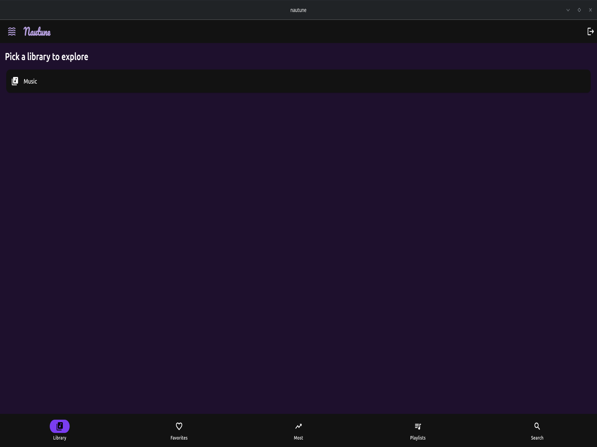
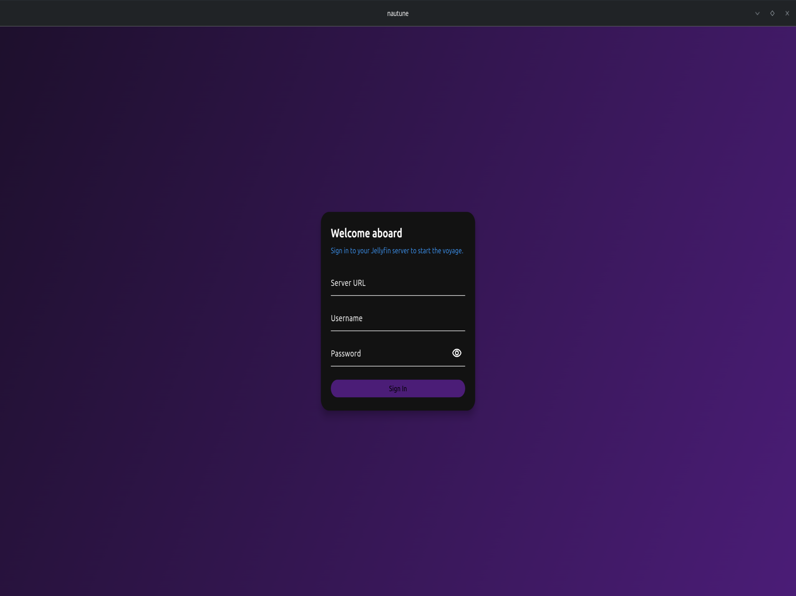
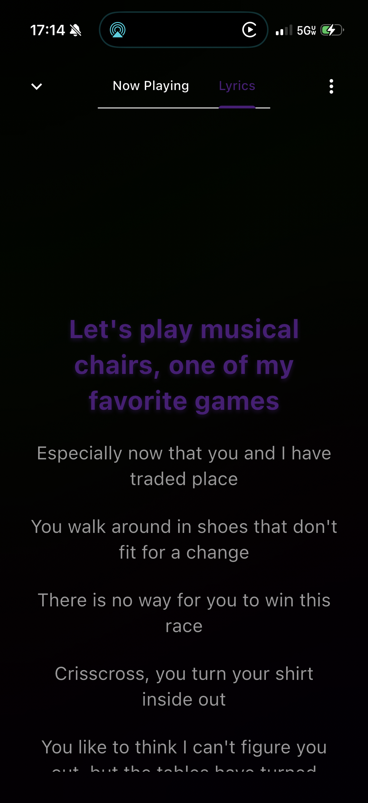
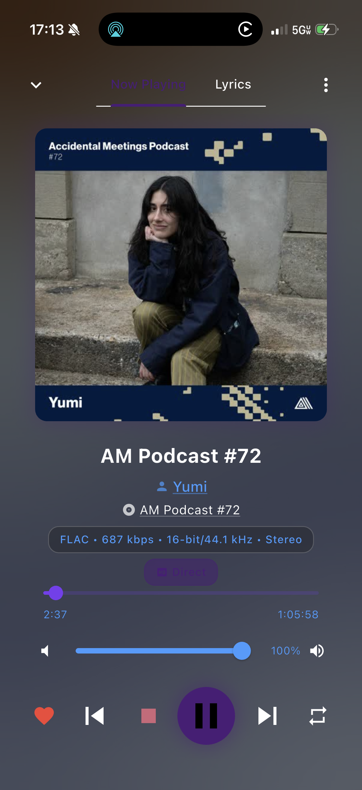
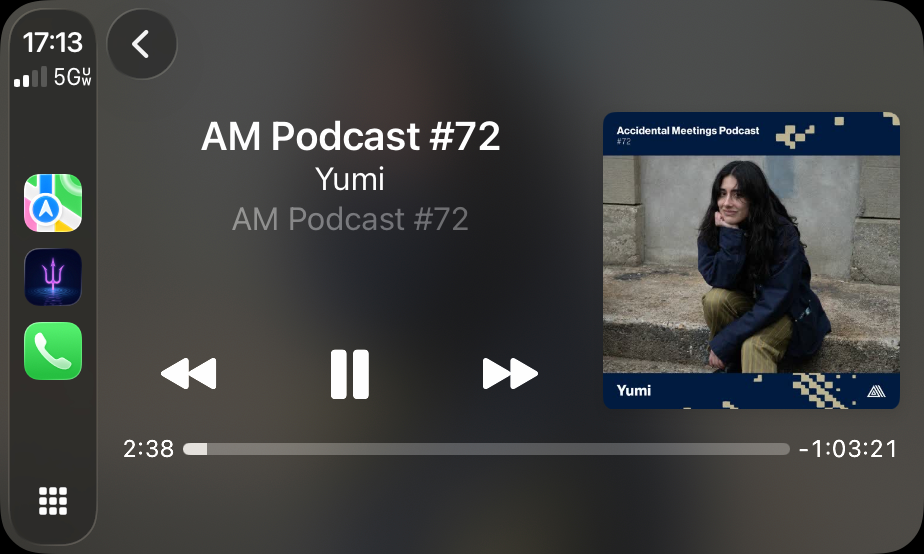
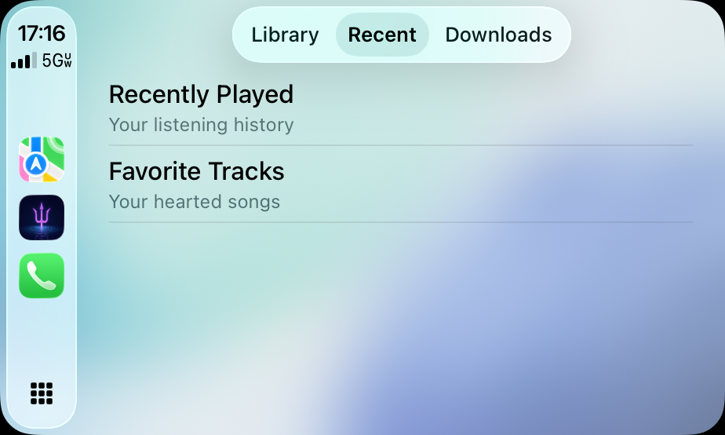

# Nautune 🔱🌊

**Nautune** (Poseidon Music Player) is a high-performance, visually stunning music client for Jellyfin. Built for speed, offline reliability, and an immersive listening experience.

## ✨ Key Features

- **Your Rewind**: Spotify Wrapped-style yearly listening reports with shareable exports
- **ListenBrainz Integration**: Scrobble your plays and get personalized music recommendations
- **Collaborative Playlists**: Real-time SyncPlay sessions - listen together with friends via QR code or share link
- **Custom Color Theme**: Create your own theme with primary/secondary color picker
- **Alternate App Icons**: Choose between Classic (purple), Sunset (orange), Crimson (red), and Emerald (green) icons across all platforms
- **10-Band Equalizer** (Linux): Full graphic EQ with 12 presets (Rock, Pop, Jazz, Classical, and more)
- **5 Audio Visualizers**: Ocean Waves, Spectrum Bars, Mirror Bars, Radial, and Psychedelic styles
- **Real-Time FFT**: True audio-reactive visualization using PulseAudio (Linux) and MTAudioProcessingTap (iOS)
- **Smart Playlists**: Tag-aware mood playlists (Chill, Energetic, Melancholy, Upbeat) using actual file tags
- **Smart Pre-Cache**: Configurable pre-caching of current and upcoming tracks (3, 5, or 10) with WiFi-only option
- **Smart Lyrics**: Multi-source lyrics with sync, caching, and pre-fetching
- **41 Nautical Milestones**: Earn achievements as you listen
- **Track Sharing**: Share downloaded audio files via AirDrop (iOS) or file manager (Linux)
- **Storage Management**: Separate views for downloads vs cache with accurate stats
- **Listening Analytics**: Heatmaps, streaks, and weekly comparisons
- **Global Search**: Unified search across your entire library with instant results
- **Smart Offline Mode**: Persistent offline preference, auto-detects airplane mode, seamless downloaded content playback
- **A-B Repeat Loop**: Set loop markers on downloaded/cached tracks to repeat a section (long-press with haptic feedback on iOS, or use the A-B Loop button on desktop). Save loops for later recall.
- **High-Fidelity Playback**: Native backends for Linux and iOS ensuring bit-perfect audio
- **CarPlay Support**: Take your Jellyfin library on the road with CarPlay interface
- **Personalized Home**: Discover, On This Day, and For You recommendation shelves


## 📻 The Network (Easter Egg)

A hidden radio feature [other-people.network](https://www.other-people.network) - Nicolas Jaar's experimental radio project.

### How to Access

1. Go to **Library** tab
2. Search for **"network"**
3. Tap the **"The Network"** card that appears

### Using The Network

- **Channel Dial**: Enter any number between 0-333 to tune to the nearest available channel
- **Channel List**: Browse and tap any of the 60+ available channels
- **Mute**: Toggle audio with the speaker icon in the top bar

### Save for Offline

The Network supports offline listening with auto-caching:

1. Tap the **gear icon** in the top right
2. Enable **"Save for Offline"**
3. Play any channel - it automatically downloads in the background
4. View saved channels in the settings panel with channel numbers and storage size
5. Delete individual channels or clear all from settings

When offline, only your saved channels appear in the list. The app shows an "OFFLINE" indicator when auto-cache is enabled.

### Demo Mode & Offline Access

The Network easter egg works in demo mode and airplane mode:

- **With Downloads**: If you've downloaded channels while online, they remain accessible in demo mode and offline
- **Without Downloads**: Shows a helpful message explaining that channels need to be downloaded while online
- Download all channels using the "Download All" button in Settings to ensure full offline access

### Storage Location

Network downloads are stored separately from your Jellyfin library:
- **Linux**: `~/Documents/nautune/network/audio/`
- **iOS**: `Documents/network/audio/`

### Available Channels

112 channels from the Other People Network catalog:

- the network
- traffic princess
- chance fm
- you don't know what love is
- pomegranates in the sky
- hardcore ambient
- work in progress
- waves and sirens
- feet fm
- i shoot like i talk
- heaven's floor
- we weren't made for these times
- water in heaven
- system of a downey
- the answer is in the question
- the answer starts with the word ideology
- in the face of defeat fm
- present choice
- bible fm
- the rejects am
- the rejects fm
- this house is on fire!
- red bull sponsored revolution
- our god flag fm
- naked bieber fm
- fucking classics
- pop harvey
- labour of love
- vito's room
- radio radio
- tv buddha
- century of the self
- the vacuum has no symmetry
- eternal inflation
- condensed matter systems
- multiverse fm
- the object spoke to me
- hot jungle
- spells of angels
- science needs a clown
- questions the shadow knew
- slaughter fm
- jane said of my idol that art was doing its job, tearing away its dead flesh
- cnn
- billionaire fm
- the tennis underground
- history has a way with words
- the future has no birds
- red flag
- the eternal has an accent
- the revolver on the left
- american dream radio
- young me with young you
- everyone gets into heaven
- un coup de dés jamais n'abolira le hasard
- deep symmetry
- america is perfect
- ad me to you
- mirrors still reflect if they break
- let's change the system
- mashcast
- playing with you
- make america great again
- code fm
- la resistencia de ayer es la resistencia de hoy
- sex radio
- standard model
- super symmetry
- whose world is this?
- our world
- famous heart
- fallacy
- live from gaza
- voices fm
- jump radio
- the whole world is watching
- flood fm
- live from las vegas
- yankee yankee yankee cuidado!!!
- pray fm
- it sounded like the finale of the 4th of july
- a new kind of kool aid
- mini infiniti
- spa theory
- near a burning flame
- resist stance
- niar lirpa
- matta clark demolitions
- you can be young forever
- silence fm
- vtgnike is free!!!
- against all logic
- home
- los colores no existen
- other people radio
- geography of heaven
- everywhere i go
- change your name
- life radio
- elegy for the empyre
- took me out
- the number and the siren
- aesthetic of resistance or resistance of aesthetic
- pomegranates
- regular hypnosis
- what made you made me
- radio 333
- nymphs
- sirens
- sirens (digital)


## 🎧 Essential Mix (Easter Egg)

A hidden feature to play the legendary 2-hour Soulwax/2ManyDJs BBC Essential Mix from May 20, 2017.

### How to Access

1. Go to **Library** tab
2. Search for **"essential"**
3. Tap the **"Essential Mix"** card that appears

### Features

- **2-Hour Mix**: The full Soulwax/2ManyDJs BBC Radio 1 Essential Mix
- **Download for Offline**: Download the 233MB audio file for offline listening
- **Demo Mode Support**: Works in demo mode and airplane mode if downloaded while online
- **Radial Visualizer**: Theme-colored gradient bars radiate around album art with glow effects and bass pulse rings (sonar style)
- **Seekable Waveform**: Waveform doubles as progress bar - tap or drag to seek
- **Profile Badge**: BBC Radio 1 Essential Mix badge with archive.org aesthetic appears in your Profile
- **iOS Low Power Mode**: Visualizer auto-disables when Low Power Mode is enabled to save battery
- **"Essential Discovery" Milestone**: Unlock a badge for discovering this easter egg

### Storage Location

Essential Mix downloads are stored separately from your Jellyfin library:
- **Linux**: `~/Documents/nautune/essential/audio/`
- **iOS**: `Documents/essential/audio/`

### Credit

Audio sourced from [Internet Archive](https://archive.org/details/2017-05-20-soulwax-2manydjs-essential-mix).


## 🌧️ Relax Mode (Easter Egg)

An ambient sound mixer for focus or relaxation, inspired by [ebithril/relax-player](https://github.com/ebithril/relax-player).

### How to Access

1. Go to **Library** tab
2. Search for **"relax"**
3. Tap the **"Relax Mode"** card that appears

### Features

- **3 Sound Layers**: Mix rain, thunder, and campfire sounds with vertical sliders
- **Seamless Loops**: Ambient audio loops continuously without gaps
- **Works Everywhere**: Available in demo mode, offline mode, and airplane mode (uses bundled assets)
- **Stats Tracking**: Track total time spent and sound usage breakdown (Rain/Thunder/Campfire %)
- **"Calm Waters" Milestone**: Unlock a badge for discovering Relax Mode


## 🖥️ TUI Mode (Linux)


A terminal-inspired interface for keyboard-driven music browsing, inspired by [jellyfin-tui](https://github.com/dhonus/jellyfin-tui).

### Launching TUI Mode

#### AppImage
```bash
./Nautune-x86_64.AppImage --tui
```

#### Deb Package
```bash
nautune --tui
```

#### Environment Variable (Alternative)
```bash
NAUTUNE_TUI_MODE=1 nautune
```

#### Development
```bash
flutter run -d linux --dart-define=TUI_MODE=true
```

### Keyboard Bindings

**Navigation**
| Key | Action |
|-----|--------|
| `j` / `k` | Move selection down/up |
| `h` / `l` | Navigate back/forward (switch panes) |
| `gg` / `Home` | Go to top of list |
| `G` / `End` | Go to bottom of list |
| `PgUp` / `PgDn` | Page up/down |
| `a` / `A` | Jump to next/previous letter group |
| `Tab` | Cycle through sections |
| `Enter` | Play/Select item |
| `Esc` | Exit search / Go back |

**Playback**
| Key | Action |
|-----|--------|
| `Space` | Toggle play/pause |
| `n` / `p` | Next/Previous track |
| `r` / `t` | Seek backward/forward 5 seconds |
| `,` / `.` | Seek backward/forward 60 seconds |
| `S` | Stop playback |
| `R` | Cycle repeat mode |
| `s` | Shuffle queue |

**Volume**
| Key | Action |
|-----|--------|
| `+` / `-` | Volume up/down |
| `m` | Toggle mute |

**Queue**
| Key | Action |
|-----|--------|
| `e` | Add selected track to queue |
| `E` / `c` | Clear queue |
| `x` / `d` | Delete item from queue |
| `J` / `K` | Move queue item down/up |

**A-B Loop** (for downloaded/cached tracks)
| Key | Action |
|-----|--------|
| `[` | Set loop start point (A) |
| `]` | Set loop end point (B) |
| `\` | Clear loop markers |

**Other**
| Key | Action |
|-----|--------|
| `/` | Enter search mode |
| `f` | Toggle favorite on track |
| `T` | Cycle through themes |
| `?` | Show/hide help overlay |
| `X` | Full reset (stop + clear) |
| `q` | Quit |

### Features

- **10 Built-in Themes**: Dark, Gruvbox, Nord, Catppuccin, Dracula, Solarized, and more
- **Persistent Theme**: Theme selection saved and restored between restarts
- **Album Art Colors**: Dynamic primary color extraction with smooth transitions
- **Synchronized Lyrics**: Auto-scrolling lyrics pane with multi-source fallback
- **Window Dragging**: Drag the tab bar to reposition the window
- **Tab Bar**: Top navigation with section tabs and now-playing indicator
- **Sidebar Navigation**: Browse Albums, Artists, Queue, Lyrics, or Search
- **Help Overlay**: Press `?` to see all keybindings organized by category
- **Vim-Style Movement**: Familiar keybindings with multi-key sequence support
- **Letter Jumping**: `a/A` to jump between letter groups in sorted lists
- **Queue Reordering**: `J/K` to move queue items up/down
- **Seek Controls**: `r/t` for ±5s, `,/.` for ±60s seeking
- **A-B Loop Controls**: `[/]` to set loop markers, `\` to clear (downloaded tracks only)
- **ASCII Progress Bar**: `[=========>          ] 2:34 / 4:12` with loop region indicators
- **Volume Indicator**: `Vol: [████████░░] 80%`
- **Scrollbar**: Visual scrollbar on right edge of lists
- **Buffering Spinner**: Animated indicator during audio buffering
- **Box-Drawing Borders**: Classic TUI aesthetic
- **JetBrains Mono Font**: Crisp monospace rendering

### Desktop Shortcut with TUI Option (KDE/GNOME)

Add a right-click menu option to launch TUI mode from your desktop shortcut.

Edit your `.desktop` file (e.g., `~/.local/share/applications/nautune.desktop`):

```ini
[Desktop Entry]
Actions=tui;
Comment=
Exec=/path/to/Nautune-x86_64.AppImage
GenericName=Jellyfin Music Player
Icon=/path/to/icon.png
Name=Nautune
NoDisplay=false
StartupNotify=true
Terminal=false
Type=Application

[Desktop Action tui]
Exec=/path/to/Nautune-x86_64.AppImage --tui
Icon=/path/to/icon.png
Name=Launch TUI Mode
```

Now you can:
- **Left-click** → Launch normal GUI
- **Right-click** → Choose "Launch TUI Mode"

### Requirements

- Linux only (TUI mode is not available on iOS/macOS/Windows)
- Must be logged in via GUI mode first (session persists)

---

## 🔊 FFT Visualizer Platform Support

| Platform | FFT Method | Status |
|----------|-----------|--------|
| Linux | PulseAudio `parec` loopback | ✅ Instant |
| iOS (downloaded) | MTAudioProcessingTap + vDSP | ✅ Instant |
| iOS (streaming) | Cache then tap | ✅ After cache |

---

## 🎨 Visualizer Styles

Nautune offers 5 audio-reactive visualizer styles. Access the picker via **Settings > Appearance > Visualizer Style**.

| Style | Description |
|-------|-------------|
| **Ocean Waves** | Bioluminescent waves with floating particles, bass-reactive depth |
| **Spectrum Bars** | Classic vertical frequency bars with album art colors and peak hold |
| **Mirror Bars** | Symmetric bars extending from center, creates "sound wave" look |
| **Radial** | Circular bar arrangement with slow rotation and bass pulse rings |
| **Psychedelic** | Milkdrop-inspired effects with 3 auto-cycling presets |

- **30fps rendering**: Battery-optimized frame rate with smooth interpolation
- **Fast attack / slow decay**: Musical smoothing for natural-feeling reactivity
- **Album art colors**: Spectrum visualizers extract primary color from current artwork
- **Bass boost**: All visualizers react dramatically to bass frequencies
- **Low Power Mode**: Visualizers auto-disable on iOS when Low Power Mode is active

---

## 🎵 ListenBrainz Setup Guide

ListenBrainz is a free, open-source music listening tracker. Connect your account to scrobble plays and get personalized music recommendations.

### Step 1: Create a ListenBrainz Account

1. Go to [listenbrainz.org](https://listenbrainz.org)
2. Click **Sign In / Register** in the top right
3. Create a free account (you can use your MusicBrainz account if you have one)

### Step 2: Get Your User Token

1. Log in to [listenbrainz.org](https://listenbrainz.org)
2. Click your username in the top right corner
3. Select **Settings** from the dropdown
4. Or go directly to [listenbrainz.org/settings/](https://listenbrainz.org/settings/)
5. Find the **User Token** section
6. Your token looks like: `1a2b3c4d-5e6f-7g8h-9i0j-k1l2m3n4o5p6`
7. Click **Copy to clipboard**

### Step 3: Connect in Nautune

1. Open Nautune and go to **Settings**
2. Tap **ListenBrainz** under "Your Music"
3. Tap **Connect Account**
4. Enter your ListenBrainz **username**
5. Paste your **User Token**
6. Tap **Connect**

### That's It!

Once connected:
- Tracks automatically scrobble after playing for 50% or 4 minutes
- View your listening history at [listenbrainz.org/user/YOUR_USERNAME](https://listenbrainz.org)
- Recommendations appear based on your listening patterns
- Scrobbles work offline and sync when you're back online

### Troubleshooting

| Issue | Solution |
|-------|----------|
| "Invalid token" error | Re-copy your token from ListenBrainz settings |
| Scrobbles not appearing | Check that scrobbling is enabled in Settings > ListenBrainz |
| Offline scrobbles | They'll sync automatically when you're back online |

---

## 🛠 Technical Foundation
- **Framework**: Flutter (Dart)
- **Local Storage**: Hive (NoSQL) for high-speed metadata caching
- **Audio Engine**: Audioplayers with custom platform-specific optimizations
- **Equalizer**: PulseAudio LADSPA (Linux only)
- **FFT Processing**: Custom Cooley-Tukey (Linux), Apple Accelerate vDSP (iOS)
- **Image Processing**: Material Color Utilities for vibrant palette generation

## 📂 File Structure (Linux)
Nautune follows a clean data structure on Linux for easy backups and management:
- `~/Documents/nautune/`: Primary application data
- `~/Documents/nautune/downloads/`: High-quality offline audio files
- `~/Documents/nautune/downloads/artwork/`: Cached album artwork (stored per-album to save space)
- `~/Documents/nautune/network/audio/`: Network easter egg offline channels
- `~/Documents/nautune/network/images/`: Network channel artwork

---

## 📸 Screenshots

### Linux / Desktop




### iOS




### CarPlay



## 🧪 Review / Demo Mode

Apple's Guideline 2.1 requires working reviewer access. Nautune includes an on-device demo that mirrors every feature—library browsing, downloads, playlists, CarPlay, and offline playback—without touching a real Jellyfin server.

1. **Credentials**: leave the server field blank, use username `tester` and password `testing`.
2. The login form detects that combo and seeds a showcase library with open-source media. Switching back to a real server instantly removes demo data (even cached downloads).

## 🔧 Development

### Run in Debug Mode
```bash
flutter run -d linux --debug
```

### Build Release
```bash
flutter build linux --release
```

### Build Deb Package (Linux)
```bash
# Requires: dart pub global activate fastforge
fastforge package --platform linux --targets deb
```

### Static Analysis
```bash
flutter analyze
```

## 🗺️ Roadmap

| Feature | Platform | Status |
|---------|----------|--------|
| Desktop Remote Control | iOS → Linux | 🔜 Planned |
| Additional Visualizers | All | ✅ Complete |

- **Desktop Remote Control**: Control desktop playback from iOS device over local network.

## 🙏 Acknowledgments

### Other People Network
The "Network" easter egg features audio content from [www.other-people.network](https://www.other-people.network), a creative project by **Nicolas Jaar** and the **Other People** label. The original site was programmed by **Cole Brown** with design by Cole Brown and Against All Logic, featuring mixes from Nicolas Jaar, Against All Logic, and Ancient Astronaut.

All credit for the radio content, artwork, and creative vision belongs to the Other People team. Visit [other-people.network/about](https://www.other-people.network/#/about) for the full credits list.

### Essential Mix
The "Essential Mix" easter egg features the Soulwax/2ManyDJs BBC Radio 1 Essential Mix (May 20, 2017) hosted on the [Internet Archive](https://archive.org/details/2017-05-20-soulwax-2manydjs-essential-mix). All credit for the mix belongs to Soulwax, 2ManyDJs, and BBC Radio 1.

---

## 📄 License

This project is licensed under the MIT License - see the [LICENSE](LICENSE) file for details.

**Made with 💜 by ElysiumDisc** | Dive deep into your music 🌊🎵
